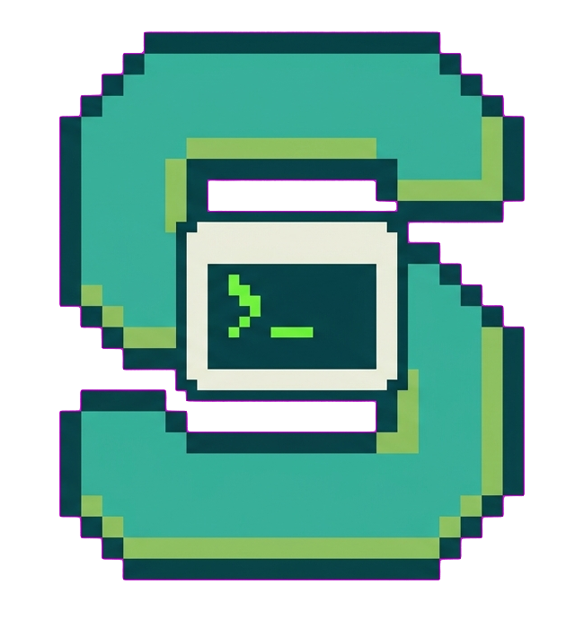

# Sessile

A lightweight, browser-based **persistent terminal session manager** — think
*tmux + the VS Code integrated terminal, in the browser*.

Terminal sessions (PTYs) live in the Go backend and keep running even when every
browser tab is closed. The browser is a thin view: it streams raw terminal bytes
to and from the backend and renders them with xterm.js. Reopen the page and your
shell — colors, cursor, scrollback and all — is restored exactly as you left it.

See [`docs/PROJECT_PLAN.md`](docs/PROJECT_PLAN.md) for the full design
specification.

## Features

- **Persistent sessions.** PTYs are owned by the backend and survive browser
  disconnects, refreshes and closed tabs.
- **Scrollback restoration.** Each session keeps a ring buffer of its raw output
  bytes; on (re)connect the buffer is replayed and xterm.js re-renders the ANSI
  stream — no server-side terminal emulation.
- **Multi-client.** Several browsers can attach to the same session and see it
  mirrored live, with per-session client counts.
- **Resilient UI.** Automatic reconnect with exponential backoff, a session tab
  bar, and a responsive layout that adapts from desktop to mobile.
- **Single binary or container.** The frontend is embedded into a static,
  CGO-free Go binary; a small multi-stage container image is also provided.

## How it works

```
Browser (xterm.js) ⇄ WebSocket ⇄ Go backend ⇄ PTY ⇄ shell process
                     REST (JSON) ⇅
                              SQLite (metadata only)
```

- The **PTY and shell live in the backend process.** Browser connections are
  ephemeral views onto them; closing every tab never affects the shell.
- Each session runs **one goroutine** that reads its PTY, appends the bytes to a
  ring buffer, and broadcasts them to all attached clients. Each WebSocket
  connection has exactly one writer goroutine, and a slow client is dropped
  rather than allowed to stall the others.
- **SQLite stores metadata only** (id, name, directory, shell, status,
  timestamps). The live PTY, ring buffer and geometry are runtime state.
- Because shells are children of the backend, **live sessions do not survive a
  backend restart.** On startup any session still marked `running` is reconciled
  to `stopped`.

### Wire protocol

The WebSocket carries two kinds of frames:

- **Binary frames** are raw terminal bytes, in both directions (keystrokes up,
  PTY output and buffer replay down).
- **Text frames** are JSON control messages: `resize` (client → server), and
  `attached` / `exit` / `error` (server → client).

## Stack

- **Backend:** Go, Gin, gorilla/websocket, creack/pty, modernc.org/sqlite
  (pure Go, builds with `CGO_ENABLED=0`).
- **Frontend:** Vue 3 + TypeScript + Vite + Tailwind CSS + Pinia + @xterm/xterm.

Go 1.25+ is required (a pure-Go dependency needs it).

## Quick start (development)

Run the backend and the Vite dev server in two terminals:

```bash
make dev-backend     # Go backend on :8080, sandbox rooted at ./sandbox
make dev-frontend    # Vite dev server on :5173, proxying /api and /ws to :8080
```

Then open <http://localhost:5173>. The sandbox root is the directory tree that
sessions are allowed to open shells in; create some subdirectories under
`./sandbox` to use them when creating a session.

## Build & run (production single binary)

```bash
make build           # build the SPA, embed it, produce ./bin/sessile
./bin/sessile --root=/path/to/workspace
```

Then open <http://localhost:8080>.

## Docker

Released images are published to GitHub Container Registry for `linux/amd64`
and `linux/arm64`. Nothing to build:

```bash
docker pull ghcr.io/andste82/sessile:latest     # or pin a release: :0.1.2

mkdir -p workspace
docker run -d --name sessile -p 8080:8080 \
  -v "$PWD/workspace:/workspace" \
  -v sessile-config:/config \
  ghcr.io/andste82/sessile:latest
```

Then open <http://localhost:8080>. Prefer a pinned tag like `:0.1.2` over
`:latest` for anything you care about — `:latest` moves with every release.

### Which variant?

Two flavours ship per release, identical in behaviour and configuration —
they differ only in the userland your **shells** get:

| Tag | Base | Size | libc | Coreutils |
|---|---|---|---|---|
| `:0.1.2`, `:latest` | Alpine | ~32 MB | musl | BusyBox |
| `:0.1.2-ubuntu`, `:latest-ubuntu` | Ubuntu 24.04 | ~107 MB | glibc | GNU |

Sessile itself is a static, CGO-free binary and runs the same on both. The
difference matters for what *you* run inside a session:

- **Alpine** (default) is small and fine when sessions only use the shell and
  the tools you install yourself.
- **Ubuntu** when sessions run precompiled binaries or language toolchains.
  Plenty of software ships glibc-linked builds that simply will not start on
  musl, and BusyBox coreutils accept a narrower set of flags than GNU ones
  (`ls --version` fails on Alpine, for instance). If you hit an unexplained
  "not found" on a binary that clearly exists, this is usually why.

```bash
docker pull ghcr.io/andste82/sessile:latest-ubuntu
```

### With compose

Save as `docker-compose.yml` and run `docker compose up -d`:

```yaml
services:
  sessile:
    image: ghcr.io/andste82/sessile:0.1.2
    container_name: sessile
    ports:
      - "8080:8080"
    volumes:
      # The directory tree sessions may open shells in. Sessions cannot escape it.
      - ./workspace:/workspace
      # Session metadata; keep it on a volume so sessions survive a restart.
      - sessile-config:/config
    # Defaults baked into the image; override to change the sandbox root, the
    # database path, or which shells are offered.
    # command: ["--root=/workspace", "--db=/config/sessions.db", "--shells=bash,zsh"]
    restart: unless-stopped

volumes:
  sessile-config:
```

The repo's own `docker-compose.yml` differs on purpose: it *builds* from source
rather than pulling, which is what you want when hacking on sessile itself.

### Building it yourself

```bash
docker compose up --build      # build from source and run
make docker                    # alpine variant, tags sessile:dev
make docker-ubuntu             # ubuntu variant, tags sessile:dev-ubuntu
```

The image is multi-stage — Node builds the SPA, Go builds a static binary, and
the runtime layer adds `bash` for shells. Both variants share the builder
stages and differ only in the final one (`--target runtime-alpine` /
`--target runtime-ubuntu`; alpine is the default target). Both ship a
`/api/health` healthcheck and run `tini` as PID 1, which reaps the zombies that
shells leave behind as grandchildren of PID 1.

Two volumes: `/workspace` (the session root) and `/config` (SQLite metadata).
The container runs as root, so treat it as having shell access to itself and
keep it behind a trusted boundary.

Check what you are running:

```bash
docker run --rm ghcr.io/andste82/sessile:latest --version
```

## Configuration

Every option is a CLI flag with an environment-variable fallback.

| Flag | Env | Default | Description |
|---|---|---|---|
| `--root` | `TSM_ROOT` | *(required)* | Sandbox root; all sessions run inside this tree |
| `--addr` | `TSM_ADDR` | `:8080` | Listen address |
| `--db` | `TSM_DB` | `<root>/.tsm/sessions.db` | SQLite database path |
| `--shells` | `TSM_SHELLS` | `bash,zsh,fish` | Shell allowlist (only installed ones are offered) |
| `--buffer-size` | `TSM_BUFFER_SIZE` | `524288` | Per-session ring buffer size, in bytes |
| `--log-level` | `TSM_LOG_LEVEL` | `info` | `debug` \| `info` \| `warn` \| `error` |
| `--dev` | `TSM_DEV` | `false` | Relax the WebSocket origin check for the Vite dev server |

`--version` prints the version and exits; `--help` lists every flag. Neither
needs `--root`.

```console
$ sessile --version
sessile 0.1.2
```

The running server reports the same value at `GET /api/config`, and the UI shows
it on the settings page.

## REST API

Base path `/api`; all responses are JSON. Example walkthrough, assuming the
backend is on `:8080` with a `project-a` directory under the root:

```bash
curl -s localhost:8080/api/health        # {"status":"ok"}
curl -s localhost:8080/api/config        # root, installed shells, version
curl -s localhost:8080/api/directories   # {"directories":["project-a"]}

# Create a session -> 201 + session JSON
curl -s -X POST localhost:8080/api/sessions \
  -H 'Content-Type: application/json' \
  -d '{"name":"Backend","directory":"project-a","shell":"bash"}'

curl -s localhost:8080/api/sessions          # list
curl -s localhost:8080/api/sessions/<id>     # get one

# Rename
curl -s -X PATCH localhost:8080/api/sessions/<id> \
  -H 'Content-Type: application/json' -d '{"name":"API"}'

# Delete (terminates the shell) -> 204
curl -s -X DELETE localhost:8080/api/sessions/<id>
```

The terminal itself attaches over `GET /ws/sessions/:id` (WebSocket). Errors use
`{"error":{"code":"…","message":"…"}}` with an appropriate HTTP status (400
validation, 404 missing, 409 conflict, 500 internal).

## Project layout

```
backend/
  cmd/server/        entrypoint (flags, wiring, graceful shutdown)
  cmd/wsclient/      small CLI WebSocket client used by scripts/wstest.sh
  internal/
    api/             Gin router, REST handlers, error envelope, middleware
    ws/              WebSocket endpoint + per-client read/write pumps
    session/         SessionManager, Session lifecycle, ring buffer, sandbox
    terminal/        PTY start / resize / signal wrappers
    storage/         SQLite open + migration + queries
    config/          flag/env configuration
  web/               embeds the built SPA
frontend/
  src/
    api/             typed REST client, shared types, WS protocol codec
    composables/     useTerminal (xterm + WebSocket wiring)
    stores/          Pinia session store
    components/      sidebar, tab bar, terminal view, dialogs
    pages/           dashboard, terminal, settings
docs/                design specification and manual checklists
```

## Testing

```bash
make test            # go vet + go test ./...  and  vitest
```

The backend suite covers the ring buffer, the directory sandbox, the SQLite
store, and full create → attach → I/O → replay → delete flows against a real
PTY. `scripts/wstest.sh` runs the same WebSocket walkthrough by hand.

GitHub Actions runs the same checks (`go vet`, `go test`, the frontend build and
`vitest`) on every push and pull request — see
[`.github/workflows/ci.yml`](.github/workflows/ci.yml).

## Security & operational notes

- Every user-supplied directory is validated against the sandbox root
  (rejecting `..`, absolute paths and symlink escapes), and shells may only be
  started from the configured allowlist.
- There is no built-in authentication. Deploy behind a reverse proxy or on a
  trusted network.
- Live sessions do not survive a backend restart (see [How it works](#how-it-works)).

## License

MIT — see [`LICENSE`](LICENSE).
