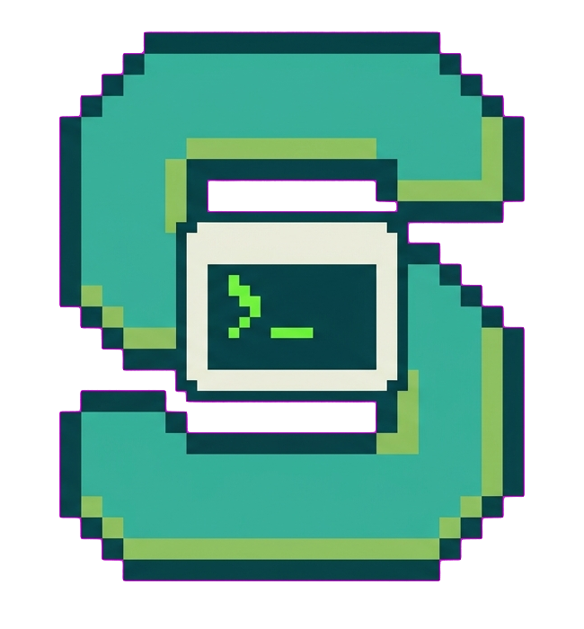

# Sessile

A lightweight, browser-based **persistent terminal session manager** — think
*tmux + the VS Code integrated terminal, in the browser*.

Terminal sessions (PTYs) live in the Go backend and keep running even when every
browser tab is closed. The browser is a thin view: it streams raw terminal bytes
to and from the backend and renders them with xterm.js. Reopen the page and your
shell — colors, cursor, scrollback and all — is restored exactly as you left it.

See [`docs/PROJECT_PLAN.md`](docs/PROJECT_PLAN.md) for the full design
specification.

## Features

- **Persistent sessions.** PTYs are owned by the backend and survive browser
  disconnects, refreshes and closed tabs.
- **Scrollback restoration.** Each session keeps a ring buffer of its raw output
  bytes; on (re)connect the buffer is replayed and xterm.js re-renders the ANSI
  stream — no server-side terminal emulation.
- **Restart after a backend restart.** A stopped session can be brought back
  under the same id with one click: same directory, same shell, its scrollback
  replayed, and arrow-up still walking the commands typed in that session.
- **Multi-client.** Several browsers can attach to the same session and see it
  mirrored live, with per-session client counts. The session is sized to the
  smallest window attached to it, so its output fits every one of them — a
  larger window has unused space, as a tmux client does, and gets it back when
  the smaller one disconnects.
- **Resilient UI.** Automatic reconnect with exponential backoff, a session tab
  bar, and a responsive layout that adapts from desktop to mobile.
- **Usable by touch.** A one-finger drag scrolls the backlog and keeps coasting
  after a flick. Where a program draws its own screen — `less`, `htop`, an
  editor — the drag reaches the program instead, exactly as a mouse wheel does
  on a desktop, since the alternate screen has no scrollback to move. An
  on-screen bar supplies what a phone keyboard has no keys for: Ctrl, Alt and
  Shift as sticky modifiers, plus Esc, Tab, the arrows, Home/End, PgUp/PgDn and
  Del.
- **GPU rendering.** The terminal draws through WebGL, the renderer VS Code's
  terminal uses. Where no WebGL context can be had — an old device, a
  blocklisted driver, or a context a mobile browser reclaims from a backgrounded
  tab — it falls back to xterm's DOM renderer, which is slower but no less
  correct.
- **Single binary or container.** The frontend is embedded into a static,
  CGO-free Go binary; a small multi-stage container image is also provided.

## How it works

```
Browser (xterm.js) ⇄ WebSocket ⇄ Go backend ⇄ PTY ⇄ shell process
                     REST (JSON) ⇅
                              SQLite (metadata only)
```

- The **PTY and shell live in the backend process.** Browser connections are
  ephemeral views onto them; closing every tab never affects the shell.
- Each session runs **one goroutine** that reads its PTY, appends the bytes to a
  ring buffer, and broadcasts them to all attached clients. Each WebSocket
  connection has exactly one writer goroutine, and a slow client is dropped
  rather than allowed to stall the others.
- **SQLite stores metadata only** (id, name, directory, shell, status,
  timestamps). The live PTY, ring buffer and geometry are runtime state.
- **One PTY, one size.** Every attached client reports the geometry it can
  display, and the PTY is sized to the smallest rows and the smallest cols among
  them, per axis — a phone held upright constrains the width, a shallow desktop
  window the height. Sizing to whichever client resized last would leave the
  others rendering output the program never wrote for: lines wrapping in the
  wrong place, and full-screen programs erasing rows they never drew.
- Because shells are children of the backend, **live sessions do not survive a
  backend restart.** On startup any session still marked `running` is reconciled
  to `stopped`.
- A stopped session can be **restarted**: it gets a new shell under the same id,
  in the same directory, with its scrollback and its command history restored.
  The scrollback is snapshotted to `<db-dir>/scrollback/`, and each session's
  shell is pointed at its own history file so arrow-up replays the commands
  typed in *that* session. What does not come back is what was running — a
  restarted session is a fresh shell, not a resumed one.

### Wire protocol

The WebSocket carries two kinds of frames:

- **Binary frames** are raw terminal bytes, in both directions (keystrokes up,
  PTY output and buffer replay down).
- **Text frames** are JSON control messages: `resize` (client → server), and
  `attached` / `exit` / `error` (server → client).

## Stack

- **Backend:** Go, Gin, gorilla/websocket, creack/pty, modernc.org/sqlite
  (pure Go, builds with `CGO_ENABLED=0`).
- **Frontend:** Vue 3 + TypeScript + Vite + Tailwind CSS + Pinia + @xterm/xterm
  (with the `fit`, `web-links`, `unicode11` and `webgl` addons).

Go 1.25+ is required (a pure-Go dependency needs it).

## Quick start (development)

Run the backend and the Vite dev server in two terminals:

```bash
make dev-backend     # Go backend on :8080, sandbox rooted at ./sandbox
make dev-frontend    # Vite dev server on :5173, proxying /api and /ws to :8080
```

Then open <http://localhost:5173>. The sandbox root is the directory tree that
sessions are allowed to open shells in; create some subdirectories under
`./sandbox` to use them when creating a session.

## Build & run (production single binary)

```bash
make build           # build the SPA, embed it, produce ./bin/sessile
./bin/sessile --root=/path/to/workspace
```

Then open <http://localhost:8080>.

## Docker

Released images are published to GitHub Container Registry for `linux/amd64`
and `linux/arm64`. Nothing to build:

```bash
docker pull ghcr.io/andste82/sessile:latest     # or pin a release tag

mkdir -p workspace
docker run -d --name sessile -p 8080:8080 \
  -v "$PWD/workspace:/workspace" \
  -v sessile-config:/config \
  ghcr.io/andste82/sessile:latest
```

Then open <http://localhost:8080>. Prefer a pinned release tag over `:latest`
for anything you care about — `:latest` moves with every release. The tags on
offer are on the [releases
page](https://github.com/Andste82/sessile/releases).

### Which variant?

Two flavours ship per release, identical in behaviour and configuration —
they differ only in the userland your **shells** get:

| Tag | Base | Size | libc | Coreutils |
|---|---|---|---|---|
| `:<version>`, `:latest` | Alpine | ~34 MB | musl | BusyBox |
| `:<version>-ubuntu`, `:latest-ubuntu` | Ubuntu 24.04 | ~112 MB | glibc | GNU |

Sessile itself is a static, CGO-free binary and runs the same on both. The
difference matters for what *you* run inside a session:

- **Alpine** (default) is small and fine when sessions only use the shell and
  the tools you install yourself.
- **Ubuntu** when sessions run precompiled binaries or language toolchains.
  Plenty of software ships glibc-linked builds that simply will not start on
  musl, and BusyBox coreutils accept a narrower set of flags than GNU ones
  (`ls --version` fails on Alpine, for instance). If you hit an unexplained
  "not found" on a binary that clearly exists, this is usually why.

```bash
docker pull ghcr.io/andste82/sessile:latest-ubuntu
```

### With compose

Save as `docker-compose.yml` and run `docker compose up -d`:

```yaml
services:
  sessile:
    # Pin a release tag from the releases page rather than tracking :latest.
    image: ghcr.io/andste82/sessile:latest
    container_name: sessile
    ports:
      - "8080:8080"
    volumes:
      # The directory tree sessions may open shells in. Sessions cannot escape it.
      - ./workspace:/workspace
      # Session metadata, scrollback snapshots and per-session shell history.
      # Keep it on a volume so sessions can be restarted after a container
      # restart, with their output and command history intact.
      - sessile-config:/config
    # Defaults baked into the image; override to change the sandbox root, the
    # state directory, or which shells are offered.
    # command: ["--root=/workspace", "--data-dir=/config", "--shells=bash,zsh"]
    restart: unless-stopped

volumes:
  sessile-config:
```

The repo's own `docker-compose.yml` differs on purpose: it *builds* from source
rather than pulling, which is what you want when hacking on sessile itself.

### Building it yourself

```bash
docker compose up --build      # build from source and run
make docker                    # alpine variant, tags sessile:dev
make docker-ubuntu             # ubuntu variant, tags sessile:dev-ubuntu
```

The image tag stays `dev` while its contents move, so `docker run sessile:dev`
keeps meaning "the last one I built". What the build *reports* is another
matter: Settings → Version shows `git describe` output for anything that is not
a release: the last tag, the number of commits since it and the short hash,
with `-dirty` appended if the tree had uncommitted changes — so a screenshot of
that page names the exact commit. A release is built with `VERSION` set from
its tag and reports just the tag.

The image is multi-stage — Node builds the SPA, Go builds a static binary, and
the runtime layer adds `bash` for shells. Both variants share the builder
stages and differ only in the final one (`--target runtime-alpine` /
`--target runtime-ubuntu`; alpine is the default target). Both ship a
`/api/health` healthcheck and run `tini` as PID 1, which reaps the zombies that
shells leave behind as grandchildren of PID 1.

Two volumes: `/workspace` (the session root) and `/config` (all server state —
the database, scrollback snapshots and per-session shell history). The image
offers `bash` only, rather than the binary's `bash,zsh,fish`, since that is what
it installs; add `--shells=` to the command if you install more. The container
runs as root, so treat it as having shell access to itself and keep it behind a
trusted boundary.

Check what you are running:

```bash
docker run --rm ghcr.io/andste82/sessile:latest --version
```

## Configuration

Every option is a CLI flag with an environment-variable fallback.

| Flag | Env | Default | Description |
|---|---|---|---|
| `--root` | `TSM_ROOT` | *(required)* | Sandbox root; all sessions run inside this tree |
| `--addr` | `TSM_ADDR` | `:8080` | Listen address |
| `--data-dir` | `TSM_DATA_DIR` | `<root>/.tsm` | Directory for all server state: `sessions.db`, `scrollback/` and `history/` |
| `--shells` | `TSM_SHELLS` | `bash,zsh,fish` | Shell allowlist (only installed ones are offered) |
| `--buffer-size` | `TSM_BUFFER_SIZE` | `524288` | Per-session ring buffer size, in bytes |
| `--session-retention` | `TSM_SESSION_RETENTION` | `0` | Discard stopped sessions idle longer than this on startup, with their scrollback and history. A Go duration — `720h`, not `30d`. `0` keeps them forever |
| `--log-level` | `TSM_LOG_LEVEL` | `info` | `debug` \| `info` \| `warn` \| `error` |
| `--allow-origin` | `TSM_ALLOW_ORIGIN` | *(none)* | One additional origin accepted for WebSocket upgrades, for a reverse proxy serving the UI under another name |
| `--dev` | `TSM_DEV` | `false` | Relax the WebSocket origin check for the Vite dev server |

`--version` prints the version and exits; `--help` lists every flag. Neither
needs `--root`.

```console
$ sessile --version
sessile <version>
```

The running server reports the same value at `GET /api/config`, and the UI shows
it on the settings page.

## REST API

Base path `/api`; all responses are JSON. Example walkthrough, assuming the
backend is on `:8080` with a `project-a` directory under the root:

```bash
curl -s localhost:8080/api/health        # {"status":"ok"}
curl -s localhost:8080/api/config        # root, installed shells, version
curl -s localhost:8080/api/directories   # {"directories":["project-a"]}

# Create a session -> 201 + session JSON
curl -s -X POST localhost:8080/api/sessions \
  -H 'Content-Type: application/json' \
  -d '{"name":"Backend","directory":"project-a","shell":"bash"}'

curl -s localhost:8080/api/sessions          # list
curl -s localhost:8080/api/sessions/<id>     # get one

# Rename
curl -s -X PATCH localhost:8080/api/sessions/<id> \
  -H 'Content-Type: application/json' -d '{"name":"API"}'

# Restart a stopped session: new shell, same id, scrollback and history restored
# -> 200 + session JSON (409 if it is still running)
curl -s -X POST localhost:8080/api/sessions/<id>/restart

# Delete (terminates the shell, drops its scrollback and history) -> 204
curl -s -X DELETE localhost:8080/api/sessions/<id>
```

The terminal itself attaches over `GET /ws/sessions/:id` (WebSocket). Errors use
`{"error":{"code":"…","message":"…"}}` with an appropriate HTTP status (400
validation, 404 missing, 409 conflict, 500 internal).

## Project layout

```
backend/
  cmd/server/        entrypoint (flags, wiring, graceful shutdown)
  cmd/wsclient/      small CLI WebSocket client used by scripts/wstest.sh
  internal/
    api/             Gin router, REST handlers, error envelope, middleware
    ws/              WebSocket endpoint + per-client read/write pumps
    session/         SessionManager, Session lifecycle, ring buffer, sandbox
    terminal/        PTY start / resize / signal wrappers
    storage/         SQLite open + migration + queries
    config/          flag/env configuration
  web/               embeds the built SPA
frontend/
  src/
    api/             typed REST client, shared types, WS protocol codec
    composables/     useTerminal (xterm + WebSocket wiring)
    stores/          Pinia session store
    utils/           gesture routing, key encoding, clipboard, IME, fonts
    components/      sidebar, tab bar, terminal view, dialogs
    pages/           dashboard, terminal, settings
docs/                design specification and manual checklists
```

## Testing

```bash
make test            # go vet + go test ./...  and  vitest
```

The backend suite covers the ring buffer, the directory sandbox, the SQLite
store, session sizing across several clients, and full create → attach → I/O →
replay → delete flows against a real PTY. `scripts/wstest.sh` runs the same
WebSocket walkthrough by hand. The frontend suite covers the pure logic — the
WS codec, the REST client, key and clipboard encoding, IME handling, gesture
routing — and deliberately stops there; there is no E2E framework.

What no suite here can answer is how a gesture behaves under a thumb, so
[`docs/mobile-checklist.md`](docs/mobile-checklist.md) carries the manual
passes: scrolling idle and under load, momentum, the backlog's ends, and
whether a full-screen program scrolls.

GitHub Actions runs the same checks (`go vet`, `go test`, the frontend build and
`vitest`) on every push and pull request — see
[`.github/workflows/ci.yml`](.github/workflows/ci.yml).

## Security & operational notes

- Every user-supplied directory is validated against the sandbox root
  (rejecting `..`, absolute paths and symlink escapes), and shells may only be
  started from the configured allowlist.
- There is no built-in authentication. Deploy behind a reverse proxy or on a
  trusted network.
- Live sessions do not survive a backend restart (see [How it works](#how-it-works)).
  Their scrollback and command history do, and the session can be restarted from
  the UI — but the processes that were running are gone.
- Scrollback snapshots and history files sit beside the database in
  `--data-dir`, so that volume holds terminal output. Keep it off shared storage and
  size it for `--buffer-size` per session. Stopped sessions are kept forever
  unless you set `--session-retention`; the default never deletes anything,
  because a stopped session can still be restarted with its state.
- Per-session command history is set through the shell's environment. An rc file
  that assigns `HISTFILE` itself — oh-my-zsh does — wins over that, and such a
  session keeps using the shared history file instead of its own.

## License

MIT — see [`LICENSE`](LICENSE).
